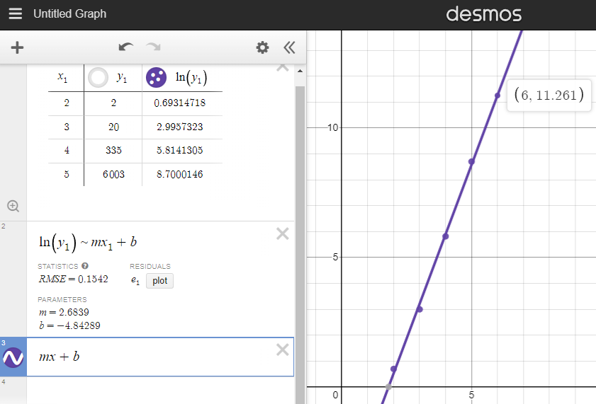

# Extra flex questions, by number of cards

## Two Cards:
Time: 6.98 milliseconds
* Best hand: (2, Q) with 2 solutions
* No solutions: 94.5%
* One solution: 1.10%

## Three Cards:
Time: 0.76 seconds
* Best hand: (A, 2, Q) with 20 solutions
* No solutions: 75.60%
* One solution: .2197%

## Four Cards:
Time: 00:02:40.9 (140.91 seconds)
* Best hand: (A, 4, 8, Q) with 335 solutions
* No solutions: 25.165%
* One solution: .87912%

## Five Cards:
Time: 10:23:42.25 (37422.25 seconds)
* Best hand: (A, A, 4, 8, Q) with 6003 solutions
* No solutions: 1.35747%
* One solution: .177763%

## Six Cards:
TODO: optimize this shitty code enough to get this to run in less than 6 months
NOTE: according to this graph, the number of expected solutions should be somewhere around 77730

